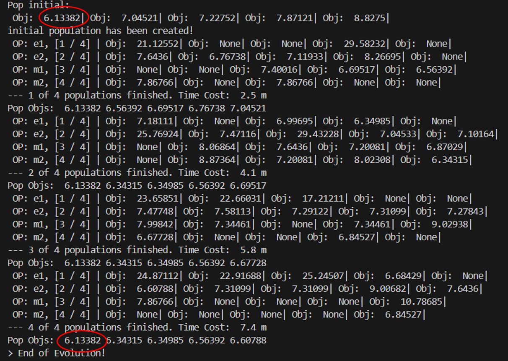

# Evolution of Heuristics – LLM-based Heuristic Algorithm Design

This repository documents my study and implementation of the following research paper, which explores how Large Language Models (LLMs) can be combined with evolutionary strategies to automatically generate effective heuristic algorithms.

本專案旨在深入理解該論文提出的 EoH 框架，探討其如何結合大型語言模型 (LLM) 與演化式計算 (EC)，自動化產生啟發式演算法 (Heuristics)。本專案亦實作論文提供的 GitHub 程式碼，並進一步分析結果

> **Evolution of Heuristics: Towards Efficient Automatic Algorithm Design Using Large Language Model**  
> [📄 Paper Link](https://arxiv.org/abs/2401.02051) | [🔗 Official GitHub](https://github.com/FeiLiu36/EoH)

This project includes:
- A detailed summary and analysis of the paper’s methodology and contributions
- Hands-on implementation based on the official codebase
- Personal observations, limitations, and suggestions for improvement

## 目錄
- [📄 論文重點整理](#-論文重點整理)
- [📄 個人觀點](#-個人觀點)
- [📄 EoH 流程實作 (基於論文提供的 GitHub)](#-eoh-流程實作-基於論文提供的-github)

<br>

## 📄 論文重點整理

### 1. 研究背景
- 在組合最佳化問題中，啟發式算法 (Heuristics) 是常用且高效的求解方法。 
- 傳統啟發式算法多由人類專家手動設計，依賴經驗且難以遷移。 
- 目前已存在「使用 LLM 實現自動化啟發式設計 (AHD)」 的研究，如 FunSearch，但需大量模型查詢，計算成本高。 

### 2. 研究目的
- 提出 EoH (Evolution of Heuristics) 框架，結合了大型語言模型 (LLMs) 與演化計算 (EC) 方法，用於實現自動化啟發式設計 (AHD)。
- EoH 理念：以自然語言 thought 表達高啟發式算法的邏輯 → LLM 生成 Python 程式 → 達成在演化架構中不斷優化 thoughts 與 code (貼近人類的設計邏輯)。

### 3. EoH 方法說明

- #### step 1. 初始族群建立

  - 利用初始化的 prompt，讓 LLM 產生 N 個 heuristics，形成初始族群 $P = \{ h_1, ..., h_N \}$
  - 每個個體包含：
    - **Thought**：以自然語言描述 heuristic 邏輯
    - **Code**：Thought 對應的 Python 函數（含名稱、input、output 等資訊）
    - **Fitness**：該 heuristic 在多筆資料上的平均測試表現

- #### step 2. 迭代演化

  - 每個世代執行 5 種 prompt 策略（operator），每個策略各執行 N 次，共產生 $5N$ 個新 heuristics offspring
  - 每個 operator 重複以下流程：

    - 從當前族群中挑選 parent heuristics：選中機率與 fitness 排名成正比 P(hᵢ) ∝ 1 / (rankₕᵢ + N)

    - 請 LLM 根據 operator prompt 產生新的： heuristic thought (自然語言邏輯)、對應的 code (可執行函數)

    - 用多筆實例測試新 heuristic 的效能，取得平均 fitness 分數

    - 若新產生的 heuristics 與程式碼合法且可執行，則加入目前族群中

  - 最後從全部個體中挑選 fitness 最高的 N 個 heuristics，作為下一代族群成員，進入下一世代


- #### 其中論文提出的 5 種 prompt 策略如下：
  <table>
    <thead>
      <tr>
        <th>類型</th>
        <th>名稱</th>
        <th>說明</th>
      </tr>
    </thead>
    <tbody>
      <tr>
        <td>探索類</td>
        <td>E1</td>
        <td>產出跟多個 parent heuristic 差異越大越好的新 heuristic</td>
      </tr>
      <tr>
        <td>探索類</td>
        <td>E2</td>
        <td>找出多個 parent heuristics 的共通想法，並設計基於共通邏輯但新穎的 heuristic</td>
      </tr>
      <tr>
        <td>修改類</td>
        <td>M1</td>
        <td>修改 parent heuristic 的程式結構或邏輯，讓它更好</td>
      </tr>
      <tr>
        <td>修改類</td>
        <td>M2</td>
        <td>調整 parent heuristic 的參數，但不變邏輯</td>
      </tr>
      <tr>
        <td>修改類</td>
        <td>M3</td>
        <td>精簡 parent heuristic，刪除冗餘元件讓它更簡潔</td>
      </tr>
    </tbody>
  </table>


### 4. 實驗結果
- #### EoH 實驗於三種最佳化問題
  <table>
  <thead>
    <tr>
      <th>項目</th>
      <th>Online Bin Packing (OBP)</th>
      <th>Traveling Salesman Problem (TSP)</th>
      <th>Flow Shop Scheduling Problem (FSSP)</th>
    </tr>
  </thead>
  <tbody>
    <tr>
      <td>任務描述</td>
      <td>將物品依序放入容量有限的箱子中，最小化所用箱數</td>
      <td>找出一條最短的路徑拜訪所有城市一次並回起點</td>
      <td>安排多道工序於多台機台上，最小化總完工時間</td>
    </tr>
    <tr>
      <td>測試資料</td>
      <td>• 使用 5 筆 Weibull 分布的測試資料<br>• 每筆有 5,000 個物品，箱子容量固定為 100</td>
      <td>• 使用 64 筆 TSP100 資料<br>• 每筆座標位置隨機分布在 [0,1]^2</td>
      <td>• 64 組隨機產生資料<br>• 每組含 50 個作業與 2~20 台機器，每筆作業處理時間為 [0,1] 區間內的隨機數</td>
    </tr>
    <tr>
      <td>EoH 的任務</td>
      <td>設計分配物品到箱子的評分函數 (scoring function)<br>• 輸入：物品大小 、各箱子的剩餘空間<br>• 輸出：每個箱子的 fitness 分數</td>
      <td>設計 Guided Local Search (GLS) 函數更新方法<br>• 輸入：距離矩陣、當前路徑、路徑邊數<br>• 輸出：更新後的距離矩陣</td>
      <td>設計 Guided Local Search (GLS) 函數更新方法<br>• 輸入：時間矩陣、當前排程、機器與工作數量<br>• 輸出：更新後時間矩陣、排程優先度</td>
    </tr>
    <tr>
      <td>Fitness 指標</td>
      <td>Fitness = 最佳解 / 啟發式算法結果<br>• 最佳解：用 Martello & Toth 方法計算的最小箱數</td>
      <td>Fitness = (啟發式算法結果 − 最佳解) / 最佳解<br>• 最佳解：Concorde 求解結果</td>
      <td>Fitness = (啟發式算法結果 − 最佳解) / 最佳解<br>• 最佳解：Taillard (1993) 的 benchmark 資料集</td>
    </tr>
    <tr>
      <td>演化設定</td>
      <td>• 世代數：20<br>• Population size：20</td>
      <td>• 世代數：20<br>• Population size：10</td>
      <td>• 世代數：20<br>• Population size：10</td>
    </tr>
    <tr>
      <td>Prompt 設計</td>
      <td>• 使用五種演化 prompt：E1, E2, M1, M2, M3<br>• 每次產出 heuristic 的「描述 + Python 程式碼」</td>
      <td>• 使用五種演化 prompt：E1, E2, M1, M2, M3<br>• 每次產出 heuristic 的「描述 + Python 程式碼」</td>
      <td>• 使用五種演化 prompt：E1, E2, M1, M2, M3<br>• 每次產出 heuristic 的「描述 + Python 程式碼」</td>
    </tr>
    <tr>
      <td>LLM</td>
      <td>GPT-3.5 Turbo</td>
      <td>GPT-3.5 Turbo</td>
      <td>GPT-3.5 Turbo</td>
    </tr>
    <tr>
      <td>Local Search</td>
      <td>無</td>
      <td>使用 GLS + relocate + 2-opt</td>
      <td>使用 GLS + relocate、swap</td>
    </tr>
    <tr>
      <td>最大執行條件</td>
      <td>無</td>
      <td>每筆 TSP 測資最多跑 1000 次迭帶或 60 秒</td>
      <td>每筆 TSP 測資最多跑 1000 次迭帶或 60 秒</td>
    </tr>
    <tr>
      <td>結果</td>
      <td>• EoH 成果在幾乎所有測資中勝出其他方法，僅 10k C100 稍差於 FunSearch<br>• 查詢次數僅約 2000，遠低於 FunSearch 百萬次</td>
      <td>• 在 TSPLib 經典資料集中，EoH 多次找出最佳已知解<br>• 對 unseen data 分布有優異表現</td>
      <td>• 在所有測試組合中，EoH 產出的 heuristic 都拿下最佳解</td>
    </tr>
  </tbody>
  </table>

- #### prompt 策略組合實驗 (Ablation Study)
  <table>
  <thead>
    <tr>
      <th>Prompt 組合</th>
      <th>實驗結果</th>
    </tr>
  </thead>
  <tbody>
    <tr>
      <td>只生成 code</td>
      <td>效能最差，證明自然語言描述有助於 LLM 提升 heuristic 品質</td>
    </tr>
    <tr>
      <td>E1</td>
      <td>大規模問題下表現較差</td>
    </tr>
    <tr>
      <td>E1 + E2</td>
      <td>效能比只用 E1 顯著提升，顯示結構化 prompt 提升效果。</td>
    </tr>
    <tr>
      <td>E1 + E2 + M1 + M2 + M3</td>
      <td>在多數情境下達到最佳表現，證明 prompt 多樣化有助於探索空間</td>
    </tr>
  </tbody>
  </table>
  → 由 Ablation Study 實驗可結論出：Prompt 策略選擇對於求解結果具有顯著影響

### 5. 結論
- 提出 EoH：一種新穎的框架，能在幾乎不需手工設計與無需訓練特定領域模型的情況下，自動演化出 thoughts 與 codes。
- 設計了一套簡單但有效的 prompt 策略：能幫助 LLM 產生更具多樣性且高效能的 heuristics，這些策略也可延伸應用到其他 LLM 搜尋方法上。
- EoH 進行了全面的實驗評估：在三個經典組合最佳化問題上表現優異，其中在 TSP 任務中找到多筆 benchmark 最佳解，而在在「線上裝箱問題」上，EoH 所需的 LLM 查詢次數大幅低於 FunSearch。

<br>

## 📄 個人觀點

### 1. 對「同時演化 Thought + Code」的看法
- **實現人類專家思維**：人類在設計 heuristics 時，通常會先有一個概念或想法 (thought)，再實作成演算法 (code)。EoH 讓 LLM 模擬這種「先思考再實作」的過程，不僅貼近真實，也讓產生的程式更具邏輯與可讀性。

- **提升 LLM 生成 Heuristics 的品質**：給 LLM 明確的自然語言思考方向 prompt 後再請它寫 code，有助於降低無意義或錯誤程式碼的機率。從論文的 ablation study 可以看出，同時演化 thoughts 和 codes 比單純演化 codes 效果更好。

- **便於後續人類理解與維護**：多數自動產生演算法的方法僅生成 code，但 EoH 的 heuristic 有自然語言描述，能幫助人理解演算法邏輯。

### 2. 對 EoH 架構的改善建議

- **維持族群多樣性**
  - 問題：無論是 E 或 M 系列的 prompt，生成的算法都來自於前幾代的高分個體，導致新產生的 heuristic 越來越類似這些主流解法。
  - 改進方向：用 embedding 模型將每個 heuristic 的 thought 轉成向量，對整個族群中的 heuristic 兩兩計算 cosine similarity (語意相似度)，如果某個 offspring 和已有個體太相似 (e.g.  > 0.95)，表示語意太相似，就不保留它，改生成新的個體來替補。

- **動態調整 prompt 策略比例**
  - 問題：目前 EoH 的演化流程，每一代都固定使用 5 種 prompt，但可能有些策略在某些階段幾乎沒產生任何有幫助的 offspring，而某些策略在早期 (探索階段) 或晚期 (收斂階段) 特別有用
  - 改進方向：如果族群中個體的 fitness 值很集中 (已經趨近收斂) → 增加使用 E1, E2 探索；如果族群的 fitness 值很分散 (還在大範圍探索階段) → 增加使用 M1~M3 修改現有高分個體；若某 prompt (如 M3) 連續 N 代都產生效果不佳的 offspring → 暫停該策略一代。

- **語意一致性檢查**
  - 問題： LLM 根據 prompt 中的自然語言描述來生成 code 的過程，可能因語境理解或格式偏差，導致 code 沒有完全反映出 thought 的想法。
  - 改進方向：可 prompt LLM 反向解釋程式碼 (code → thought)，再與原始 thought 進行比對，若差異太大則不保留該個體，或降低其 fitness。
  
### 3. 其他 Prompt 發想
- **E3**：從低分個體中產生「跳脫原邏輯」的新解法
  - 設計思路：給定目前族群中「分數較低」的 parent heuristic，並告訴 LLM 這些個體表現不好，請 LLM 想像「完全不同方向」的做法，模擬人類從錯誤中跳脫舊思維，嘗試全新概念，可以避免產生的個體都跟高分個體很相似，過早收斂。
  - Prompt 範例："The following heuristics performed poorly in solving the problem. They reflect some of the current approaches being used. Please ignore their logic and design a completely different heuristic based on a radically new idea or perspective.   Do not refine or fix the existing strategies. Instead, imagine a totally different direction, as if starting from scratch."
  
- **E4**：引入人類經典演算法邏輯與現有 heuristic 融合
  - 設計思路：告訴 LLM 目前正在解的問題類型 (如 TSP)，並提供該領域的經典演算法原理 (如 2-opt、greedy、Lin-Kernighan 等) 作為靈感來源，結合目前族群中的 parent heuristic（如表現不錯的個體）邏輯，引導 LLM 發想出融合經驗與創意的新啟發式算法。
  - Prompt 範例："You are solving a Traveling Salesman Problem (TSP). Based on the classical heuristics such as 2-opt, greedy, and nearest neighbor, design a new heuristic that combines their core ideas. You may also refer to the logic of the following heuristic and enhance it by integrating domain knowledge to improve performance."
  
- **M4**：融合多個優秀 heuristic 的優點
  - 設計思路：讓 LLM 分析多個表現優異的 heuristic，觀察它們各自的邏輯優勢，進而設計出一個融合多方優點的集成版本。這樣的整合策略可提升泛化能力，並降低單一 heuristic 表現不穩定所帶來的風險。
  - Prompt 範例：”Analyze the logic of each heuristic, identify their strengths, and design a new heuristic that integrates the best ideas from them. The goal is to create an ensemble strategy that is more robust and generalizable.”
  
- **M5**：針對語意不一致個體重新改寫程式碼 (應用於演化後期)
  - 設計思路：要求 LLM 解釋現有 heuristic 的邏輯，再請它「重新調整程式碼，使其更符合語意描述」。
  - Prompt 範例：”Explain the logic of the following code. Then refine the code so that it better matches the described heuristic idea.”
  
### 4. Fitness 評估瓶頸
- 問題：每個個體需要在多個測試實例上運行才能得到 Fitness 值，而每一代最多會產生 5N 個個體 (來自 E1、E2、M1~M3)，造成整體評估次數急劇上升。

- 改進方法：採兩階段策略，先在測試資料子集合評估，再篩選前 K 進行完整評估
  - 建立測試集子集合：假設資料集有 64 個問題實例，每代隨機抽出一小部分 (例如 8 個)
  - 每個 heuristic 只在子集合裡的實例上評估，得到初步的 fitness 分數
  - 對初步 fitness 分數排序，選出前 K 個個體，在完整的 64 個實例上進行評估 (完整 fitness)

<br>

## 📄 EoH 流程實作 (基於論文提供的 GitHub)

### 1. 參數設定
| 物件類別 | 參數 | 數值 | 說明 |
|------|------|------|------|
| Paras | problem | "tsp_construct" | 選擇 TSP 問題 |
| Paras | llm_api_endpoint | "api.deepseek.com" | API 網址 |
| Paras | llm_model | "deepseek-chat" | 使用 DeepSeek Chat V2 |
| Paras | ec_pop_size | 5 | 族群大小 (每個世代演算法數量) |
| Paras | ec_n_pop | 4 | 世代數 |
| Paras | ec_m | 2 | prompt 策略 e1與 e2 要挑選的 parent 數量 |
| Paras | selection | "prob_rank" | 依據 fitness 排序的機率，選擇 parent |
| Paras | management | "pop_greedy" | 依據 fitness 分數，篩選出前 ec_pop_size 高的個體 |
| Paras | ec_operators | ['e1','e2','m1','m2'] | 使用的演化 prompt 策略 |
| Paras | ec_operator_weights | [1, 1, 1, 1] | 每個演化 prompt 策略的使用權重 |
| TSPCONST | n_instance | 8 | TSP 實例數量 |
| TSPCONST | problem_size | 50 | TSP 實例的城市數 |

### 2. 程式檔案結構（個人理解）
```plaintext
執行主程式 📄examples/tsp_construct/runEoH.py
│
├── 建立參數物件 Paras() (📄eoh/utils/getParas.py)
│   └── 使用 set_paras() 設定所有參數：
│       • method = "eoh" → 使用 Evolution of Heuristics 方法
│       • problem = "tsp_construct" → 解 TSP 問題
│       • 其他參數：llm_model, ec_pop_size, ec_n_pop, exp_n_proc...
│
└── 建立演化物件 EVOL(paras) (📄eoh/src/eoh/eoh.py)
    │
    ├── 呼叫 create_folders() (📄eoh/utils/createFolders.py)
    │   • 建立儲存演化結果的資料夾
    │
    └── 執行 EVOL.run()
        ├── 呼叫 Probs(paras) (📄eoh/src/eoh/problems/problems.py)
        │   • 根據 paras.problem 載入問題類別，若為 "tsp_construct"：
        │   • 載入類別 TSPCONST (📄eoh/problems/optimization/tsp_greedy/run.py)
        │     ├── 初始化問題：
        │     │   • 建立 GetData 物件並呼叫 generate_instances()（📄./tsp_greedy/get_instance.py） 
        │     │     - 隨機產生 8 組、每組 50 點的 TSP 實例（含座標與距離矩陣）
        │     │   • 使用 GetPrompts() 定義 prompt 所需的函式格式 (📄./tsp_greedy/prompts.py)
        │     │     - 函式名稱：select_next_node
        │     │     - 函式輸入：["current_node", "destination_node", "unvisited_nodes", "distance_matrix"]
        │     │     - 函式輸出：["next_node"]
        |     |     - 輸入與輸出說明："xxx_node" 為節點編號，"distance_matrix" 為節點之間的距離矩陣。
        |     |     - 其他說明：所有變數皆為 NumPy arrays。
        |     |
        │     └── 績效評估函式 evaluate(code_string)
        │         • 建立一個空白的 Python 模組物件 heuristic_module
        │         • 利用 exec() 將 LLM 回傳的程式碼字串，動態執行並放進 heuristic_module 的命名空間中
        │         • 呼叫 greedy() 並傳入 heuristic_module，執行其中的 select_next_node() 走過每個 TSP 實例，計算 tour cost
        │         • 回傳 8 組 TSP 實例的平均 tour cost，作為該段程式碼的 fitness 分數
        │
        ├── 建立 methodGenerator = Methods(paras, problem) (📄eoh/methods/methods.py)
        │        ├── 讀取 paras.selection → 選擇個體選擇策略 (如 prob_rank, roulette_wheel, tournament...)
        |        |   • 對應 📄 eoh/methods/selection.py
        |        |   • 目前設定為 prob_rank → 演算法個體會依照 fitness 排序，fitness 越高越容易被挑選為 parent
        │        ├── 讀取 paras.management → 選擇族群管理策略（如 pop_greedy, ls_greedy...）
        |        |   • 對應 📄 eoh/methods/management.py 
        |        |   • 目前設定為 pop_greedy → 每輪會選出 fitness 最好的前 pop_size 名作為新一代 population
        │        └── 呼叫 methodGenerator.get_method() → 決定使用哪個演化方法
        │            • 若 paras.method = "eoh"：
        │              - 載入 EOH 類別（📄eoh/methods/eoh/eoh.py）
        │              - 回傳 EOH(paras, problem, select, manage) 物件，並呼叫 method.run() 以執行 EOH.run()
        |
        └── 執行 EOH.run() 開始整個演化流程 (📄eoh/methods/eoh/eoh.py)：
            ├── Step 1. 建立物件 interface_ec = InterfaceEC (📄 eoh/methods/eoh/eoh_interface_EC.py)
            │    ├── 初始化 __init__()
            |    |   • 傳入參數：pop_size, timeout, n_proc, use_numba, select, manage, api_key, llm_model...
            |    |   • 預設 n_create = 2（每次初始族群生成將重複 2 輪）
            |    |   • 建立 Evolution() 物件（負責呼叫 LLM 並帶入對應 prompt）
            |    |   • 儲存 prompts，並設定 debug 模式、numba 加速等
            |    |
            │    ├── population_generation() → 建立初始族群 population：
            │    |   • 呼叫 get_algorithm(pop=[], operator='i1') → 用 i1 operator 隨機生成 pop_size 個演算法
            |    |   • 重複呼叫 n_create 次，共產生 n_create × pop_size 個演算法    
            |    |   • 呼叫 evaluate()，評估每個 offspring 的 fitness
            |    |   
            │    ├── get_algorithm(pop, operator) → 產生 pop_size 個演算法個體
            |    |   • 用指定的 operator 跑 pop_size 次 get_offspring(pop, operator) 
            |    |
            |    ├── get_offspring(pop, operator) → 生成一個演算法個體 offspring 
            │    │   • 呼叫 _get_alg(pop, operator) → 根據 operator，使用對應的 prompt 產生 heuristic
            |    │     - 例如: 若 operator='e1' → 從 pop 裡選出 m 個 parent，並用 evol.e1() 生成 offspring
            |    │     - 例如: 若 operator='m1' → 從 pop 裡選出 1 個 parent，並用 evol.m1() 生成 offspring
            │    │     - 在 evol.e1() 內部：
            │    │        ├── 建立 prompt（📄 eoh_prompts.py）
            │    │        │   • 呼叫 evol.get_prompt_e1/e2/m1/m2() → 根據 operator 建立對應 prompt
            │    │        │   • 呼叫 GetPrompts() 物件 (📄/tsp_greedy/prompts.py) → 取得函式名稱、輸入輸出參數與說明，組合完整 prompt 字串
            │    │        ├── 呼叫 LLM API (📄eoh/llm/interface_LLM.py)
            │    │        │   • 使用 get_response(prompt) 發送 prompt 給指定的 LLM 模型（如 DeepSeek）
            │    │        │   • 回傳 Python 程式碼（內含 select_next_node() 定義）
            │    │        │   • 回傳 heuristic 字串（如 algorithm, code）給 get_offspring()
            |    |        └── • 將 offspring 程式碼傳入 evaluate(code_string) → 評估 offspring fitness
            │    │
            │    └── check_duplicate() → 檢查 offspring 與 population 是否重複（最多 retry 1 次）：
            │        • 若重複 → 等待 1 秒，再呼叫一次 _get_alg()
            |        • 若仍失敗 → 回傳空的 offspring 結構 (objective = None)
            |
            ├── Step 2. 建立初代 population
            │    • 使用 interface_ec.population_generation() 產生 n_create × pop_size 個 heuristic，
            |    • 使用 manage.population_management() 以 greedy 模式選出前 pop_size 名
            │    • 儲存為 population_generation_0.json
            |
            ├── Step 3. 進入演化流程迭代 → for pop in range(0, n_pop):
            │    ├── 對每種 operator（如 e1, e2, m1, m2）依序進行: → for i in range(n_op):
            │    │    └── 呼叫 interface_ec.get_algorithm(population, operator) → ：
            │    │        • 用指定的 operator 跑 pop_size 次 get_offspring(pop, operator) 
            │    │        • 產生 pop_size 個 offspring
            |    |        • 用 8 組 TSP instance 計算每個 offspring 的 fitness
            |    |
            |    ├── 每個世代共產生 pop_size x n_op 個 offspring，與原 population 合併
            |    |
            │    └── population = manage.population_management(population + offspring) → 篩選出前 pop_size 個
            │        • 儲存為 population_generation_str(pop+1).json
            │
            └── 演化世代結束，回傳最終 population，並儲存最佳 heuristic 文字、程式碼與 fitness
```

### 3. 實作結果
- **結果觀察**：根據下圖執行日誌可知，初始族群即出現最佳解 6.13382，後續 4 代演化未能超越初始解，最終結果仍與初始解相同

  

  <br>

- **可能原因分析**：
  - 搜索空間設計不佳：Prompt 演化策略過於保守，缺乏創新性與激進探索機制
  - 族群更新太保守 ：每輪都只保留前 pop_size 最佳解，可能讓族群陷入局部最佳
  - 族群多樣性不夠：新個體存在數個無效解 (Obj: None) 、測試實例太少
  - LLM 有時候會產出語法錯誤、邏輯錯誤或是無法正確運行的程式，導致執行錯誤 evaluate() 回傳 None 

- **改善方法**：
  - 更嚴謹描述 Prompt：在 prompt 裡加入明確條件：「不得重複走過的城市」、「回傳整數」、「結果必須在未拜訪城市中選一個」
  - 增加初代族群 quality ：多次隨機產生初代個體，並篩掉 Obj: None
  - 調整 population 更新：保留一定比例中等解
  - 增加測試實例 (現在只有 8 筆 TSP 實例)

<br>

## 📄 免責聲明

本專案為個人研究與學習用途，所含內容包括對公開論文與開源專案之整理、分析與延伸實作，僅供技術交流與非商業參考使用。

本 repo 不包含任何非公開資料或公司機密資訊，所有原始論文與程式碼之版權均屬原作者所有。